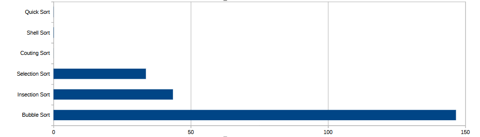

<div align="center">
  <h1>Algoritmos de ordenação</h1>
  <p> Esse trabalho tem como objetivo estudar diversos algoritmos de ordenação e então coloca-los em prática para comparar a eficiencia de cada um deles por meio de uma base de dados ficticia.</p> <br></br>
 
  <h3>Algoritmos utilizados no trabalho: </h3>
</div>

* **Bubble Sort**
  * Descricao: Algoritmo desmasiadamente simples que compara elementos adjacentes e em caso de estarem errados os troca.
<br></br>
* **Insertion Sort**
  * Descricao: Utiliza uma lista auxiliar para inserir os elementos já em ordem crescente.
<br></br>
* **Selection Sort**
  * Descricao: Este algoritmo procura o menor elemento da lista e então colocar ele na primeira posição e assim se repete por toda a extensão da lista.
<br></br>
* **Couting Sort**
  * Descricao: Algoritmo não comparativo que assume que os elementos da entrada são inteiros não negativos e limitados a um certo intervalo. Conta o número de ocorrências de cada elemento e usa essa informação para colocar os elementos em suas posições corretas.
<br></br>
* **Shell Sort**
  * Descricao: Este algoritmo é uma variantes do Inserction Sort, com a diferença de que ele compara elementos distantes e gradualmente diminui o intervalo de comparação.
<br></br>
* **Quick Sort**
  * Descricao: Algoritmo de divisão e conquista que seleciona um pivô e particiona a lista em duas sublistas, uma com elementos menores que o pivô e outra com elementos maiores. Recursivamente aplica o mesmo processo às sublistas.
<br></br>
<h3>Abaixo colocarei um exemplo da estrutura utilizada para esse trabalho:</h3>

```cpp
struct informacoesProduto {
    char nome[100];
    int quantidadeVendida;
    float preco;
    char dataDaVenda[11];
};
```
<br></br>
<h3>E por fim os tempos de execução de cada um dos algoritmos de ordenação, juntamente com seus respectivos graficos, que trabalharam para ordenar em ordem crescente: </h3>
<div align="center">
  
  <h2>Grafico para 1.000 registros</h2>
  
  <br></br>
  <h2>Grafico para 100.000 registros</h2>
  
  <br></br>
  <h2>Grafico para 1.000.000 registros</h2>
  

  <h2>Considerações Finais</h2>
  <p>De acordo com todos os testes realizados podemos chegar a conclusão de que quando estamos trabalhando com uma base de dados gigante, algoritmos como o Couting, Quick e Shell sort caem muito bem e tem um ótimo desempenho. Se tratando de base de dados menores temos fortes indicados como Selection, Quick e Shell sort com os mehlores desempenhos.</p>
</div>


